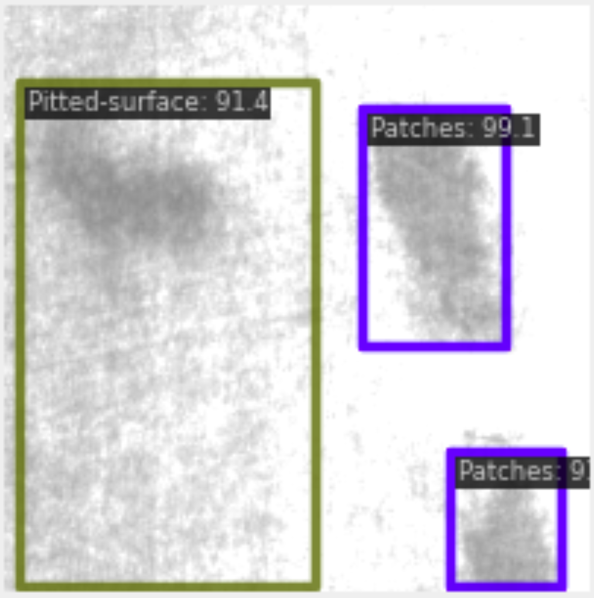
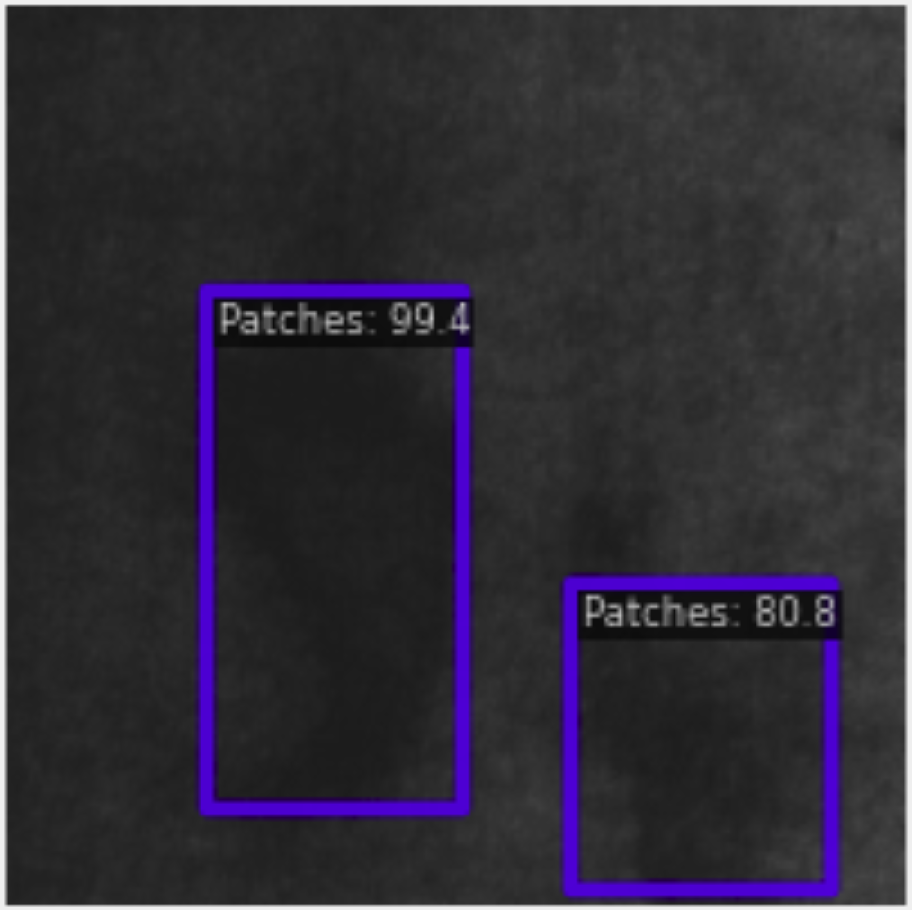
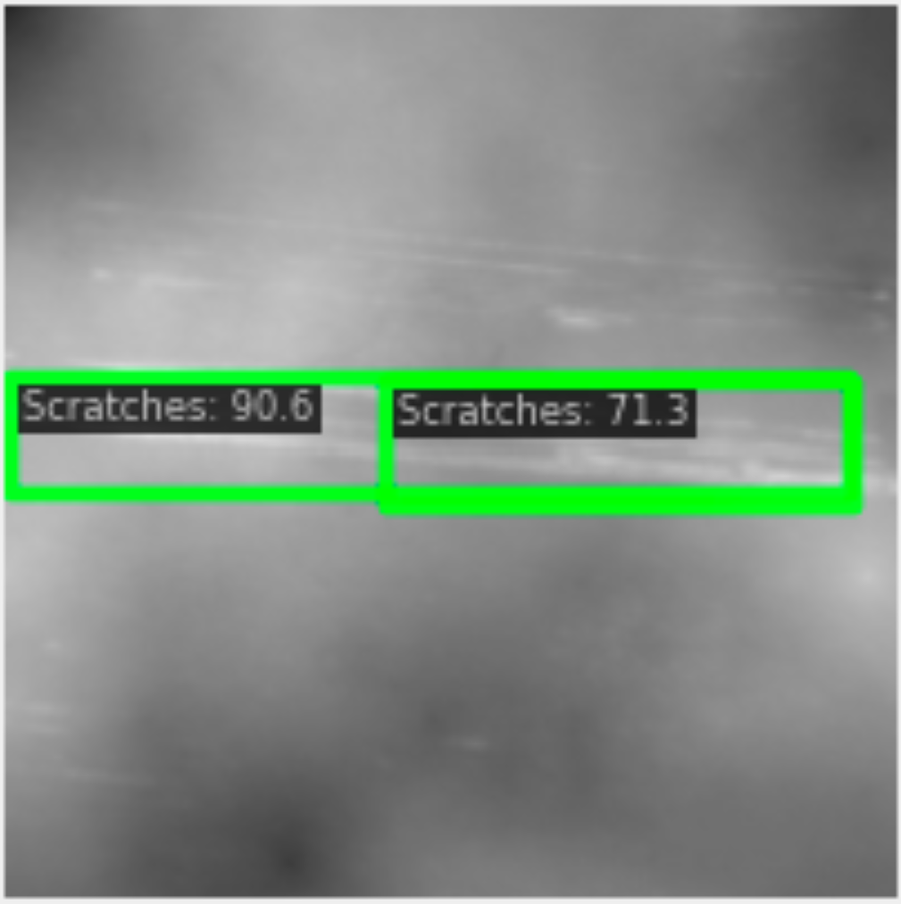
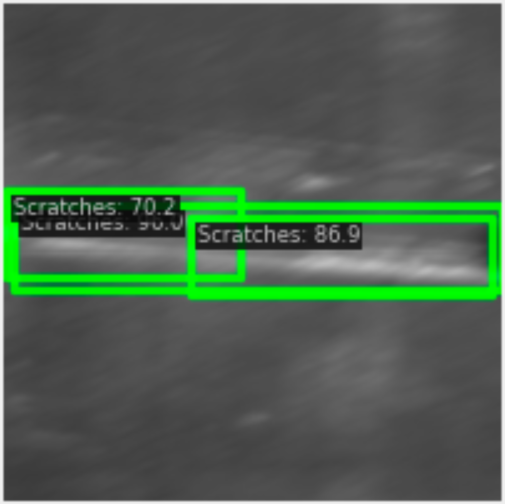

This work is built on the repository https://github.com/Chan-Sun/IFSDD. Thanks for making it open source!

Check source code in the folder `defect`

## Installation

See [installation.md](packages/installation.md)

## Demo

### Videos
<video width="320" height="240" autoplay loop>
  <source src="assets/zoom_out_test.avi" type="video/avi">
  Your browser does not support the video tag.
</video>
<video width="320" height="240" autoplay loop>
  <source src="assets/scratches_detection.avi" type="video/avi">
  Your browser does not support the video tag.
</video>

### Images

## Training
Incremental learning consists of two stages:

During inference different environmental conditions are applied.

