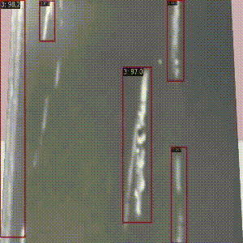
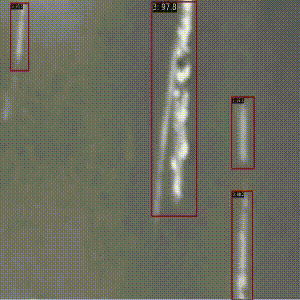
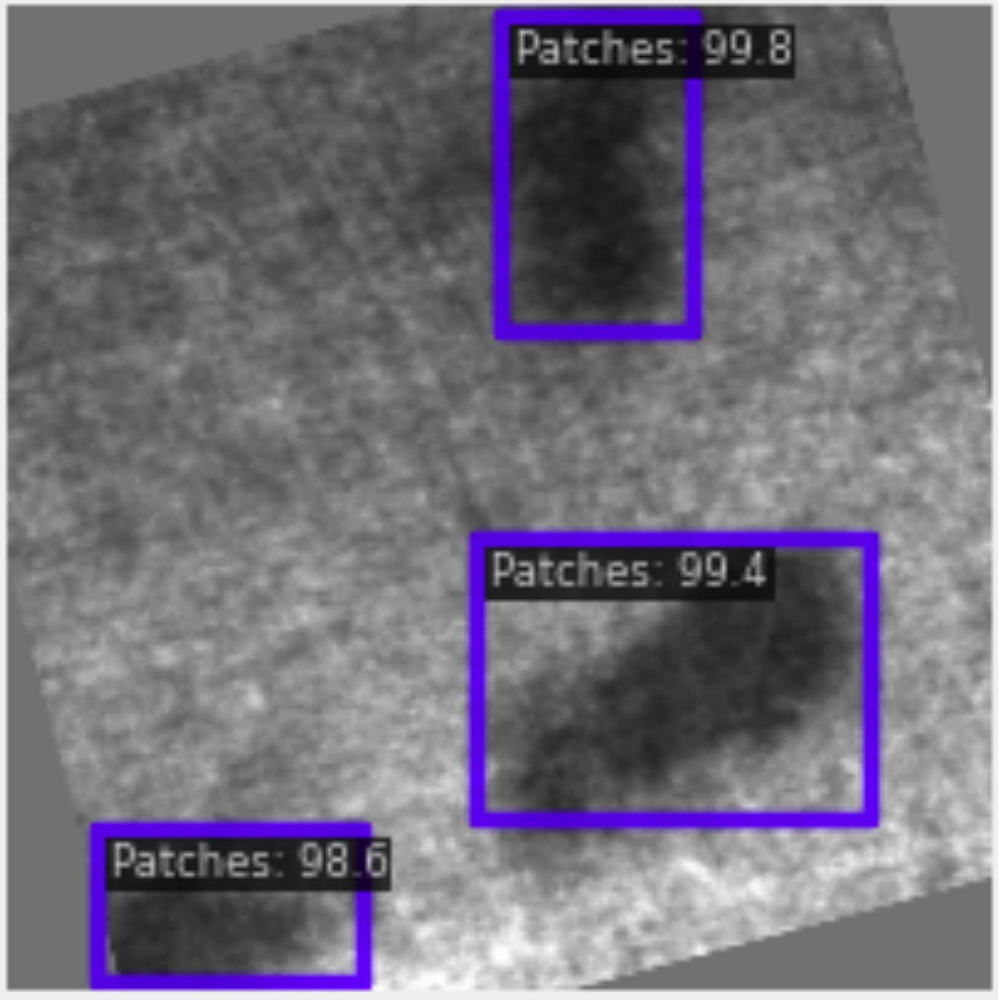
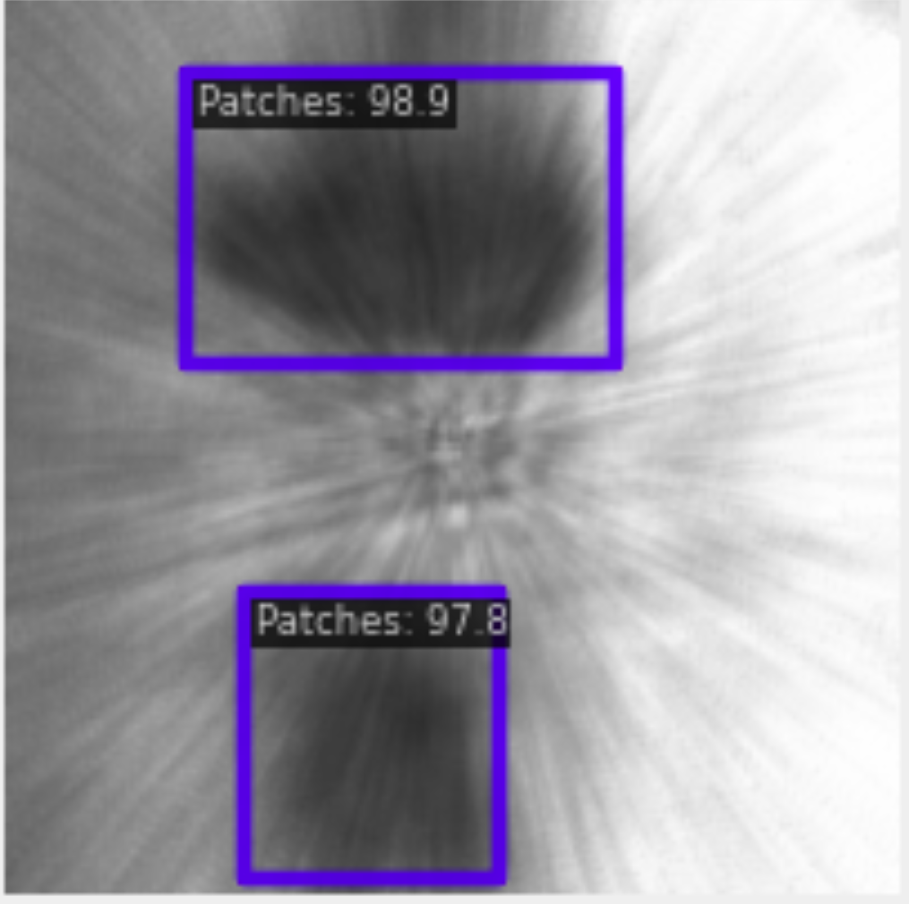
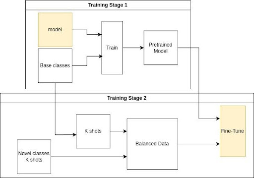
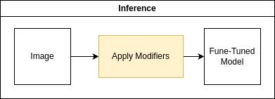
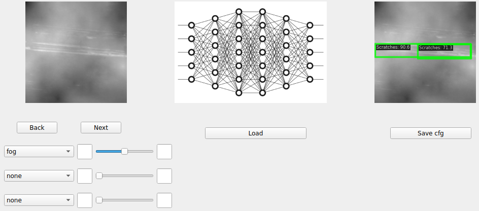

This work is built on the repository https://github.com/Chan-Sun/IFSDD. Thanks for making it open source!

This repository contains the code for the Master's Thesis [**Visual Anomaly Detection in Industrial Environments Using Quadcopter's On-Board RGB Camera**](assets/VISUAL-ANOMALY-DETECTION.pdf)

Check out source code in the folder `defect`

## Demo

  
  

 
Inference on inspection conditions
 
 

  
  
  
  
  
  

## Installation

See [installation.md](installation.md)

## Incremental Learning
The model is able to learn new defects incrementally. The training paradigm consists of two stages:
<!--   -->

During inference different environmental conditions are applied.
<!--   -->

## GUI for image augmentation
This GUI is designed to test the robustness of any model for different conditions applied on the input images. It visualizes the augmented images, and updates the configuration of the pipeline of test data, and generate a bash file containig the test commands to run testing on multiple configurations consequently. The default augmentations are: `none`, `gaussian_noise`, `shot_noise`, `impulse_noise`, `motion_blur`, `zoom_blur`, `snow`, `fog`, `brightness`, `contrast`, `elastic_transform`, `pixelate`, `jpeg_compression`, `speckle_noise`, `spatter`, `saturate`.
 
 

