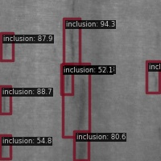
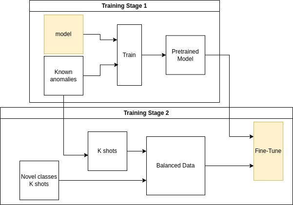
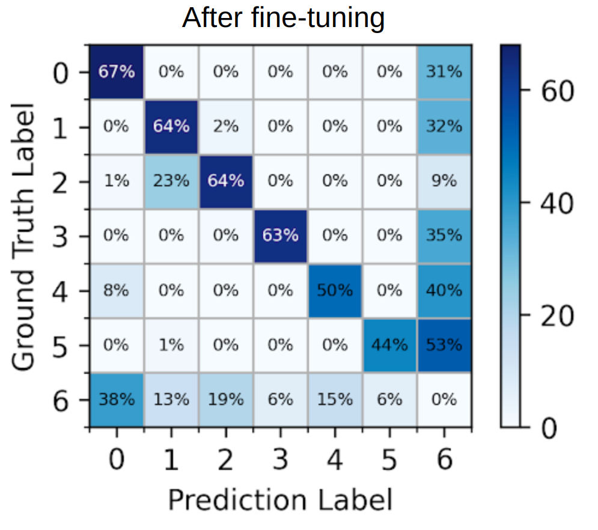
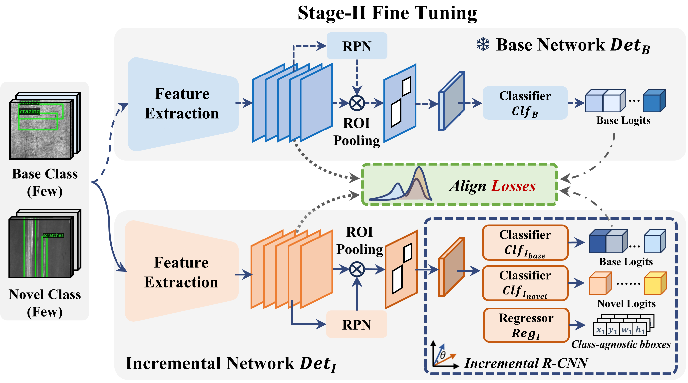
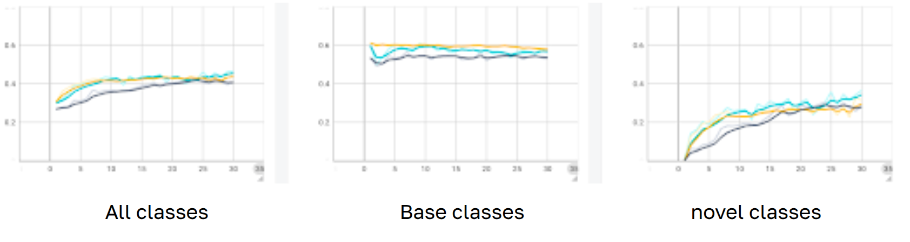
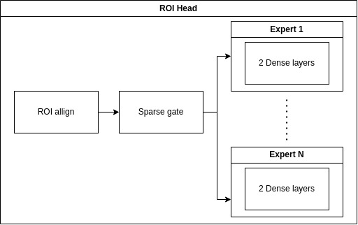

This repository contains the code for the Master's Thesis [**Visual Anomaly Detection in Industrial Environments Using Quadcopter's On-Board RGB Camera**](assets/VISUAL-ANOMALY-DETECTION.pdf) [[PDF]](assets/VISUAL-ANOMALY-DETECTION.pdf)

Check out source code in the folder `defect`

## Demo

  
  

 

Inspection on a close surface:

 

Inference on inspection conditions:
`brightness`, `contrast`, `fog`, `rotation`, `motion blur`, `zoom blur`
 
 

  
  
  
  
  
  

## Installation

See [installation.md](installation.md)

## Incremental Learning
The model is able to learn new defects incrementally. The training paradigm consists of two stages:
<!--   -->

## Fine-tuning
When training Faster RCNN then fine-tuning it directly, the `catastrophic forgetting` phenomenon was observed.
 
1. The model is trained on 3 categories of defects.
2. The model is fine-tuned on 3 additional categories of defects.
 
**Observation:** When the model learns new defects, it forgets the old ones.
 
We see the drop in accuracy from: 86%, 90%, 94% to 67%, 64%, 64%.

  
  

## Fine-tuning with knowledge distillation
To deal with catastrophic forgetting, the DKAN framework was used.
This framework is taken from https://github.com/Chan-Sun/IFSDD. Thank you for making the code available.
 
It creates two copies of the model, and uses the teacher-student paradigm based on knowledge distillation to remind the model of its previous knowledge.

## Stopping Catastrophic Forgetting
DKAN (Yellow)  
FSCE (light blue)  
Direct fine-tuning (dark blue)

DkAN could successfully maintain a constant performance (mAP) after fine-tuning.

## GUI for image augmentation
This GUI is designed to test the robustness of any model for different conditions applied on the input images. It visualizes the augmented images, and updates the configuration of the pipeline of test data, and generate a bash file containig the test commands to run testing on multiple configurations consequently. The default augmentations are: `none`, `gaussian_noise`, `shot_noise`, `impulse_noise`, `motion_blur`, `zoom_blur`, `snow`, `fog`, `brightness`, `contrast`, `rotation`, `elastic_transform`, `pixelate`, `jpeg_compression`, `speckle_noise`, `spatter`, `saturate`.
 
 

## Additional experiment: Mixture-of-Experts
Mixture of experts was incorporated into the last two layers of the ROI head. The results were identical. Check out the code in the folder `moe`.

